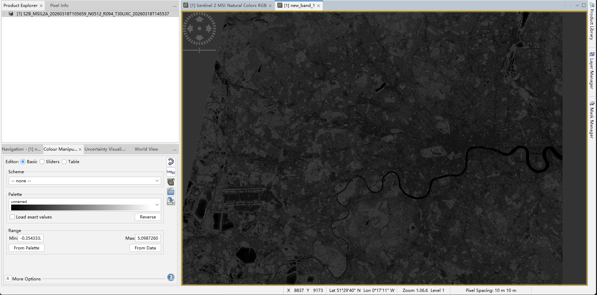

# Week 1 — Getting Started with Remote Sensing

## Summary

Remote sensing technology—based on Earth Observation (EO)—can be used to gather data about the Earth’s surface without direct contact, thus making it possible to collect information on a wide range of environmental conditions in a large-scale and consistent manner. Satellite data, as pointed out in the lecture, is an important means of detecting patterns and changes that field-based methods cannot easily capture by themselves. A theme that was addressed this week is how various surfaces interact with electromagnetic radiation. By passive sensors, optical remote sensing tracks reflected sunlight in different wavelengths. These differences in reflectance create a spectral signature, and are used to differentiate land cover types. For example, vegetation tends to strongly reflect near-infrared radiation while absorbing visible red light, whereas built-up urban surfaces generally exhibit lower and more uniform reflectance. Data visualization of patterns in land cover and its correlation with physical properties is possible by means of RGB imagery, false colour composites, vegetation indices, etc. This week's work was primarily focused on defining a clear link between spectral behavior and land cover classification, a foundational phase.

## Data Exploration and Visualisation

The practical component focused on exploring satellite imagery through a series of visualisation techniques, each providing a different perspective on surface reflectance and land cover characteristics. The analysis began with a comparison of natural colour RGB imagery from Sentinel-2 and Landsat data. While both datasets capture similar spatial patterns, the Sentinel-2 image provides noticeably higher spatial resolution, allowing for clearer identification of urban structures, green spaces, and river features. In contrast, the Landsat image appears more generalised, with finer details less distinguishable.

To further enhance the visibility of vegetation, a false colour composite was generated using near-infrared (NIR) bands. In this representation, vegetation appears in bright red tones due to its strong reflectance in the NIR region, while urban areas and water bodies remain relatively subdued. This visualisation makes it easier to distinguish vegetated areas from built-up surfaces.

Finally, a scatter plot comparing B4 (red) and B8 (near-infrared) bands was used to explore the relationship between different spectral bands. The plot shows a clear clustering pattern, indicating that different land cover types occupy distinct regions in spectral feature space. This relationship is particularly important for classification, as it highlights how multiple bands can be combined to improve discrimination between surface types.

## Spectral Analysis and Interpretation

Moving beyond visual interpretation, I focused on analysing the spectral characteristics of different land cover types, particularly using the near-infrared (B8) band. The distribution of B8 values density indicates how various categories respond to the near infrared region in the land cover. Different vegetation types such as forestry and grass have significantly larger reflectance than urban and high density urban environments. This is consistent with expected behaviour of vegetation reflecting a very high level of near infrared radiation as a function of the leaf structure within. In contrast, built-up surfaces tend to have lower and more compact reflectance ranges.

The spectral signature comparison across multiple bands further supports this pattern. The vegetation classes show a distinct increase in reflectance from the red band (B4) to the near-infrared band (B8), forming a characteristic spectral curve. Urban and bare earth surfaces exhibit a flatter response, with less variation across bands.

The spectral band relationship is also observed in the scatter plot of B4 and B8 values (See Figure 3). The plot shows that pixels tend to cluster into distinct groups, indicating that different land cover types are found in separate regions of the spectral feature space. As an example, vegetation is typically shown to have a higher value for B8 relative to B4, while urban areas are clustered into low-value regions. Although there is some overlap between classes, in general the pattern shows that combining bands provides stronger discrimination than is possible with a single band alone.

Look back to NDVI output (see Figure2), areas with high NDVI values correspond closely with regions identified as vegetation in both the false colour image and the spectral analysis, while urban areas consistently show low NDVI values. This consistency across different methods increases confidence in the interpretation of land cover patterns.

## Reflection

The prac this week assisted me in transitioning from looking only at satellite images to appreciating how and why different surfaces look the way they do. Initially, the outputs were mostly visual and descriptive, but the spectral analysis reinforced that those patterns are rooted in physical processes, particularly how different materials interact with electromagnetic radiation. One of the biggest takeaways for me was how great near-infrared data is at telling vegetation from the urban landscape. The consistency between density plots, spectral signatures, scatter plots and NDVI outputs was reassuring and not just visually convincing. However, I also knew that not all land cover types were neatly distinguished. For instance, there is some overlap in the B8 distribution between urban and bare earth, and so simply classifying according to the spectral data may entail quite the uncertainty. The selection process of training samples was another limitation. In this case, the points were chosen by hand, so inevitably some subjectivity is involved, particularly in regions where land cover is mixed or unclear. It made me realise that while the analysis appeared quantitative, at some point it still relies on human judgement. In more complicated or larger-scale applications, this may introduce bias. What’s more, the comparison between Sentinel-2 and Landsat imagery also highlighted how data resolution can influence interpretation. The higher resolution of Sentinel data facilitated easier feature recognition and training area selections, presumably enhancing the quality of the analysis.
