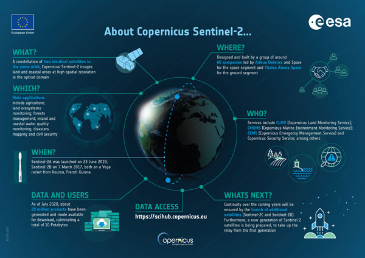
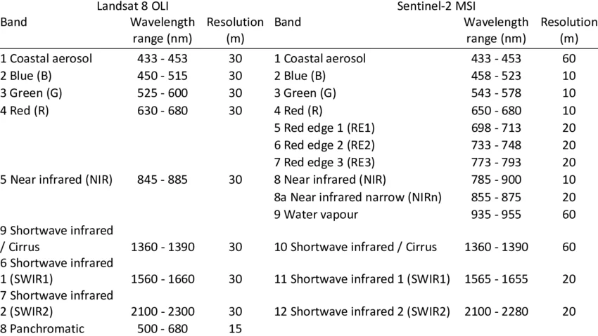
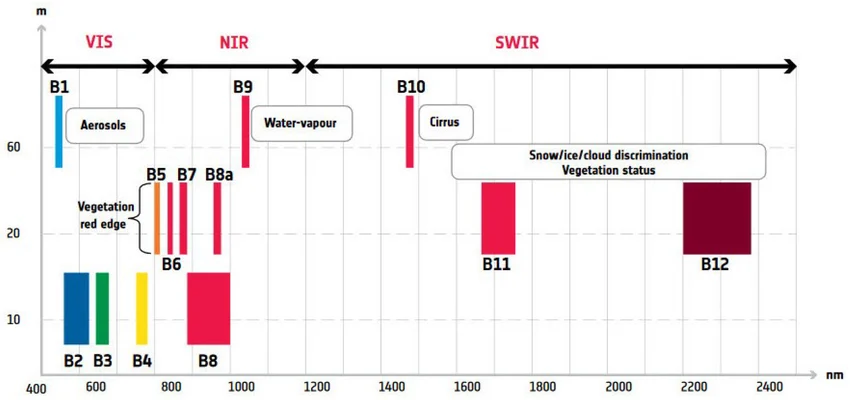
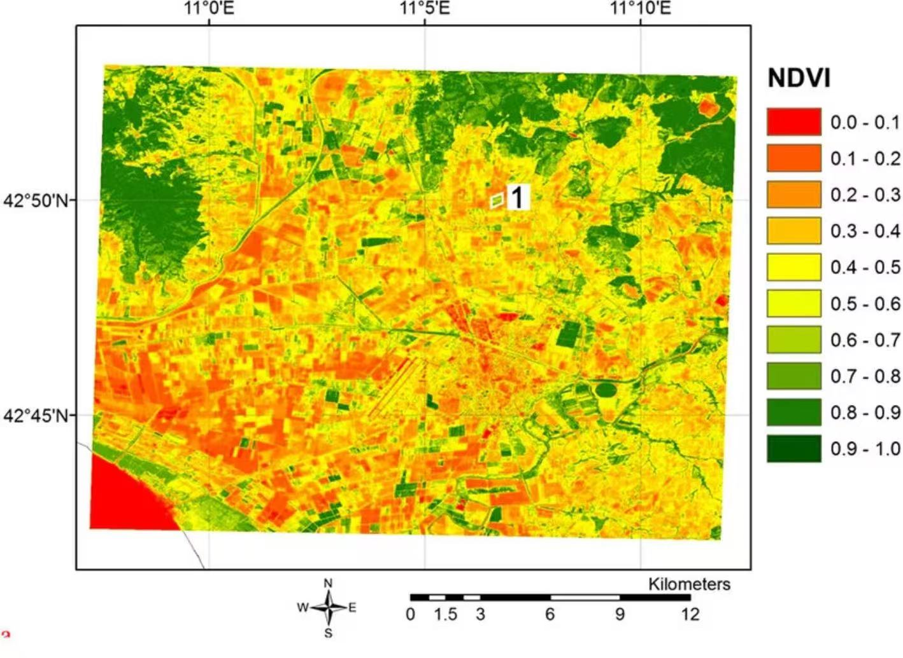
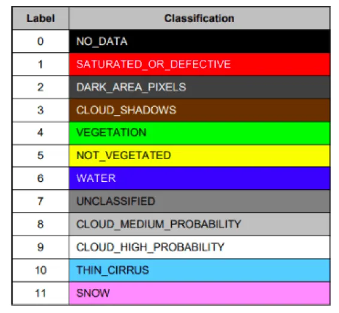
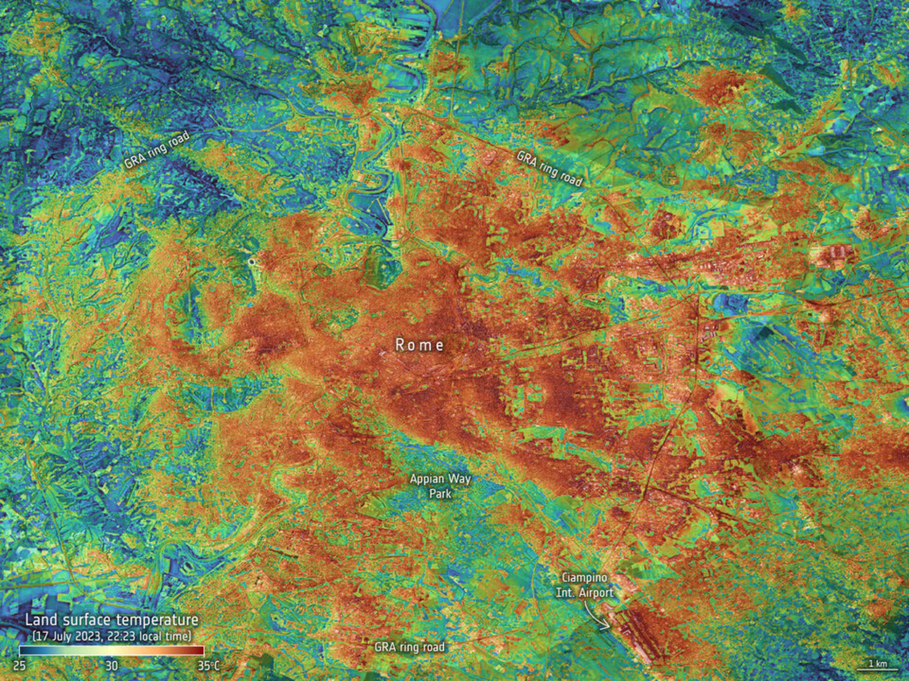

## What is Sentinel-2?

.pull-left[

Sentinel-2 is part of the European Space Agency’s Copernicus Programme and is designed to provide high-resolution optical imagery for land surface monitoring.

- Multispectral Instrument (MSI) with 13 spectral bands  
- Spatial resolution ranging from 10–60 m  
- Revisit time of approximately 5 days  

These characteristics allow Sentinel-2 to capture both spatial detail and temporal dynamics, making it particularly suitable for analysing environmental change in urban and regional contexts (Drusch et al., 2012).

]

.pull-right[

*Source: ESA (Copernicus Programme)*

]
---
## Spectral and Resolution Advantages
.pull-left[

Beyond spatial resolution, Sentinel-2 provides enhanced spectral capability compared to Landsat 8.

- Additional red-edge bands improve vegetation detection  
- Higher spatial resolution (10 m vs 30 m) captures finer urban detail  
- Broader spectral configuration supports more accurate classification  

]

.pull-right[

*Comparison of spectral bands and spatial resolution between Landsat 8 OLI and Sentinel-2 MSI  
Source: ESA (2023); USGS*

]
---
## Limitations of Sentinel-2

*dependence on optical data*.In practice, this means that cloud cover can significantly interfere with image quality, sometimes obscuring large portions of the study area.
- Clouds and cloud shadows reduce usable data  
- No data acquisition under cloudy or night-time conditions

Even partial cloud cover can fragment the image and introduce gaps, making consistent time-series analysis more difficult. This is particularly problematic in regions with frequent cloud cover.

  

*Example of cloud and shadow contamination (Source:Yuri Shendryk 2019)*

---

## Vegetation Monitoring with Sentinel-2

One of the most widely used applications of Sentinel-2 is vegetation monitoring, which relies on its spectral sensitivity in the red and near-infrared (NIR) regions.

1. NDVI exploits the contrast between red absorption and NIR reflectance  
2. Red-edge bands (unique to Sentinel-2) improve detection of vegetation condition  
3. Enables mapping of vegetation health and spatial distribution  

The availability of multiple bands in the red-edge and NIR region allows more detailed characterisation of vegetation compared to earlier sensors, supporting improved spatial analysis of green infrastructure (Alparone et al., 2024).

In practice, this makes it possible to distinguish subtle differences in vegetation condition, which is particularly useful in urban environments where vegetation is fragmented and heterogeneous.

  

*Spectral configuration of Sentinel-2 highlighting VIS, NIR and SWIR regions and their applications in vegetation monitoring (Alparone et al., 2024)*

---

## NDVI in Practice

NDVI is one of the most widely used vegetation indices in remote sensing, based on the contrast between red absorption and near-infrared (NIR) reflectance (Rouse et al., 1974).

It has been widely applied to monitor vegetation dynamics, assess ecosystem responses, and detect environmental change over time (Pettorelli et al., 2005).

In the example shown, NDVI values range from low (red/orange) to high (green), representing sparse to dense vegetation cover. This allows clear identification of agricultural patterns and spatial variability in vegetation condition.

  

*NDVI maps derived from Sentinel-2 imagery showing spatial variation in vegetation condition and agricultural patterns  
Source: Maselli et al. (2020)*

---

## Land Cover Classification

.pull-left[

Beyond vegetation indices, Sentinel-2 is widely used for land cover classification, enabling the separation of different surface types based on spectral characteristics.In urban environments, this is particularly useful for distinguishing between vegetation, impervious surfaces and water, which are often spatially mixed (Weng, 2012).

- Different land covers exhibit distinct spectral signatures  
- Multi-band data allows classification of vegetation, water and built-up areas  
- Scene Classification Layer (SCL) provides pre-defined surface categories  

]

.pull-right[

*Sentinel-2 Scene Classification Layer (SCL) categories used to distinguish land cover types  
Source: Adapted from Aimonks (2023)*

]

---

## Reflection: From Data to Urban Insights

.pull-left[

I was initially doing it primarily as a visualisation of land cover but soon realized that there’s a much deeper value in how spectral information can be made into a sense of the environment. The variation in vegetation and built-up surfaces, for instance, aren’t only a display, but a way of looking at the way in which cities operate, especially in terms of heat distribution. As demonstrated in many studies of urban heat islands, regions with impervious surfaces are more likely to retain heat, while vegetated areas have cooling effects (Xu et al., 2019). In urban environments, in which green spaces are often fragmented, mapping and quantifying these patterns is key to informing environmental quality and planning interventions. By providing a link between physical surface characteristics and questions of urban environment, the Sentinel-2 approach links different concepts or questions to one another, highlighting that physical appearances of the city are far more relevant in framing how the city in question impacts its environment (Li et al., 2020).

]

.pull-right[

*Land surface temperature patterns in Rome, illustrating urban heat island effects and spatial variation in heat distribution  
Source: ESA (2023)*

]

---

## References

- Drusch, M., Del Bello, U., Carlier, S., Colin, O., Fernandez, V., Gascon, F., et al. (2012). Sentinel-2: ESA’s optical high-resolution mission for GMES operational services. *Remote Sensing of Environment*, 120, 25–36.  
- ESA (2023). *Sentinel-2 User Handbook*. European Space Agency.  
- Alparone, L., Arienzo, A., & Garzelli, A. (2024). Spatial resolution enhancement of vegetation indexes via fusion of hyperspectral and multispectral satellite data. *Remote Sensing*, 16(5), 875.  
- Rouse, J. W., Haas, R. H., Schell, J. A., & Deering, D. W. (1974). Monitoring vegetation systems in the Great Plains with ERTS. NASA.  
- Pettorelli, N., et al. (2005). Using NDVI to assess ecological responses to environmental change. *Trends in Ecology & Evolution*, 20(9), 503–510.  
- Maselli, F., Battista, P., Chiesi, M., & Rapi, B. (2020). Use of Sentinel-2 MSI data to monitor crop irrigation in Mediterranean areas. *International Journal of Applied Earth Observation and Geoinformation*, 93, 102216.  
- Weng, Q. (2012). Remote sensing of urban environments. *International Journal of Remote Sensing*, 33(12), 3969–3982.  
- Xu, H., et al. (2019). Remote sensing of urban heat island effects. *Remote Sensing of Environment*.  
- Li, X., et al. (2020). Mapping urban green spaces using Sentinel-2 imagery. *Remote Sensing*.  

