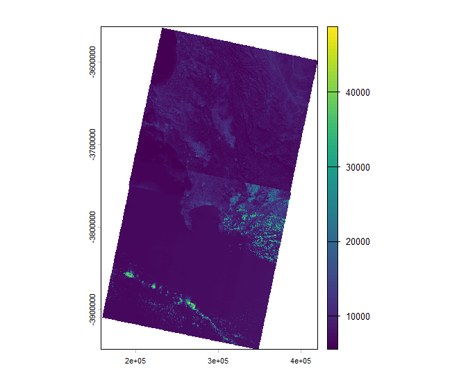
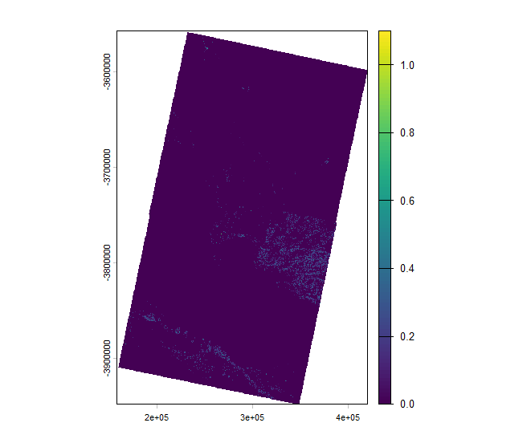
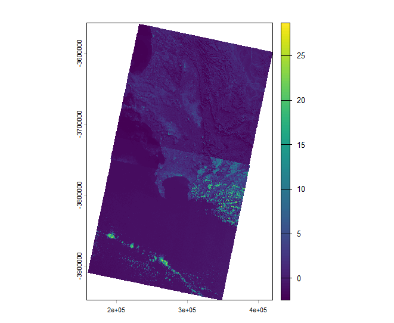

# Week 3 — Corrections

## Summary

This week felt like a step up from just visualising satellite images to actually starting to process and transform them in a more meaningful way. Instead of only looking at images, we began to think about how to prepare, enhance and combine different types of data to better understand what is happening on the ground. One thing that stood out to me is how each method adds a different layer of information. For instance, NDVI is quite intuitive and directly shows vegetation patterns, so it’s relatively easy to interpret. In contrast, texture analysis felt a bit less obvious at first, but once I understood that it looks at how pixel values change within a neighbourhood, it made more sense. In a way, it adds spatial context that a single pixel value cannot capture. At the same time, the idea of combining multiple layers and then applying PCA was quite interesting. Once NDVI and texture were added to the original bands, the dataset became much more complex, and it was no longer practical to interpret each layer separately. PCA helped simplify this by highlighting the main patterns in the data, and it was quite clear that the first component already captured most of the variation.

------------------------------------------------------------------------

## Process Workflow

The first step I did was to load and merge two Landsat scenes covering Cape Town. Since the study area spans across two tiles, a mosaic operation was required to combine them into a single image. However, the two scenes were acquired on different dates, which resulted in some visible differences in colour and brightness, especially in the southern part of the image where cloud cover is also present.

Once the mosaic was produced, a true colour composite (Band 4-3-2) was also generated to establish a baseline for visualisation. This is useful to recognize trends of general land cover, e.g., coastlines, mountainous areas, and built-up regions. The main limitation is present at this point since the mismatch between scenes introduces inconsistencies that may affect later analysis. Then NDVI, which is a simple, yet effective spectral index for visualizing vegetation, was calculated. When NDVI is compared to the RGB image, vegetated and non-vegetated areas appear in clearer separation. Vegetated regions have higher values in visual form than urban areas and water bodies do, for example. As such, NDVI provides a good basis for beginning spatial pattern analysis in the landscape.

Following this, a texture analysis was performed using a GLCM-based approach. Among the different texture metrics tested, contrast was selected because it showed the most distinct spatial variation. Unlike NDVI, which is based purely on spectral information, texture captures how pixel values change within a neighbourhood. This makes it particularly useful for identifying heterogeneous areas, such as urban regions, where pixel values vary more rapidly.

After all of this, all layers (spectral bands, NDVI, and texture) were combined and analysed using Principal Component Analysis (PCA). This step helps to reduce the complexity of the dataset by summarising the main patterns of variation into a smaller number of components. The first principal component captures the majority of the variance and provides a more integrated view of the landscape. Compared to the individual layers, the PCA output highlights broader spatial structures while still retaining key differences between land cover types.

## Challenges and Interpretation

While the overall workflow was completed successfully, several challenges came up during the process, which also helped me better understand the limitations of remote sensing data and methods.

The initial concerns pertained to atmospheric correction. At first, DOS was applied, but one of the scenes failed due to negative haze estimation. This indicates that DOS assumptions were insufficient for this dataset, either the scene did not have appropriate dark objects or the overall atmospheric conditions were already relatively clear. So the pipeline proceeded with the original imagery. This underscored that atmospheric correction is not always straightforward; hence different methods may be required depending on the data. Another problem was the discrepancy between the two Landsat images. Since they were taken on different dates, there were obvious differences in colour and brightness after mosaicking. Also, cloud cover in the southern area of the image added yet another source of inconsistency. Interpretation is therefore less accurate in some areas when sudden alterations are visible at the boundary between the two images. This made me realize that data selection is just as important as processing, and ideally, scenes should be taken at similar times and under similar conditions.

The texture analysis also required some experimentation. Initially, the homogeneity metric produced very little variation across the image, making it difficult to interpret. After testing different metrics, contrast was found to be more effective in highlighting spatial differences, particularly in urban and heterogeneous areas. This suggests that the choice of texture metric can significantly influence the results, and there is no single “best” option for all cases.

I have to mention about a practical issue when I attempt to perform PCA using the full dataset. Converting the entire raster into a dataframe caused memory limitations, which prevented the analysis from running. This was resolved by applying random sampling before PCA, which reduced the computational load while still preserving the overall structure of the data.

## Reflection

Looking back at this week’s practical, what I found most interesting is how much the outcome depends not just on the methods themselves, but on the quality and consistency of the data. At the beginning, I assumed that once the workflow is clear, the results would naturally make sense. However, issues like scene mismatch and cloud cover showed that even if the processing steps are technically correct, the outputs can still be affected quite significantly by the input data.

Another thing I discovered was that a lot of approaches we used aren’t quite as “plug-and-play” as they sound on the surface. The failure of the DOS correction and the need to explore various texture metrics say that we are not only trying out different ways of doing things, this also shows it’s not one correct way to go about things. Rather, it is often working through multiple alternatives and selecting what seems to work for a given dataset. It took the sense that there should be processes we follow for this and transformed it from being a matter of rigid steps to an exercise in fact, in making informed decisions. 

I was also exposed to the practical obstacles inherent in the use of large spatial collections. The problem of PCA and memory was what I did not anticipate initially but it demonstrated how computation-driven limitations can have a direct impact on methodological choices. However, sampling was used to solve the problem, and this made me realize that efficiency is a key consideration for real-world analysis.

