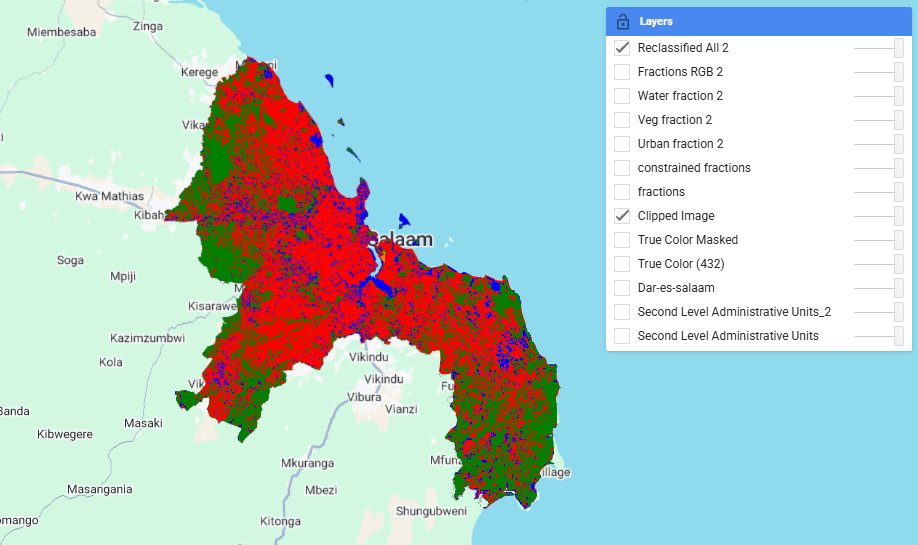
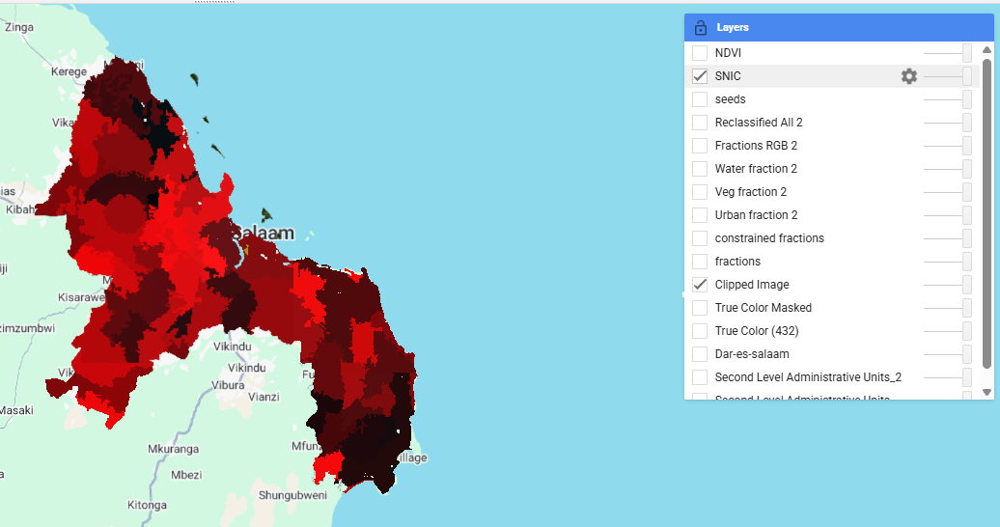
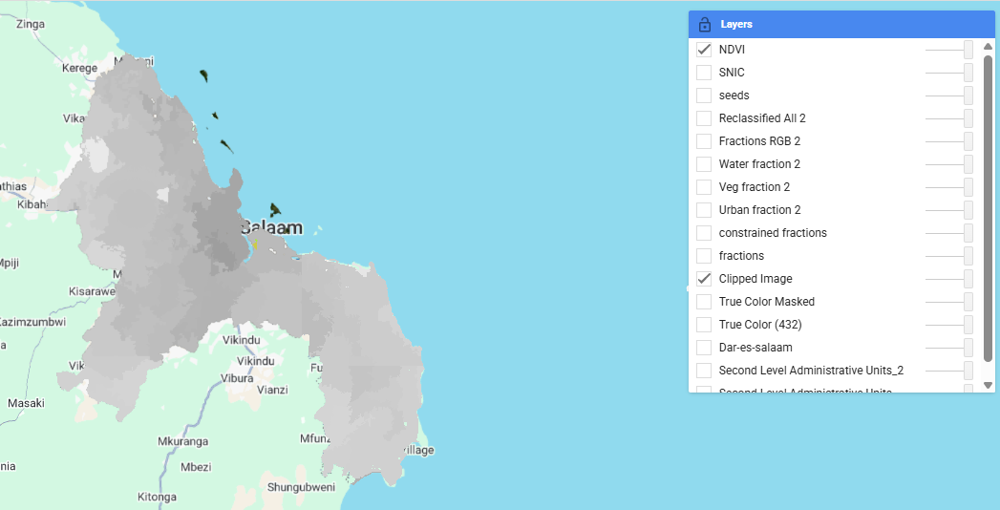
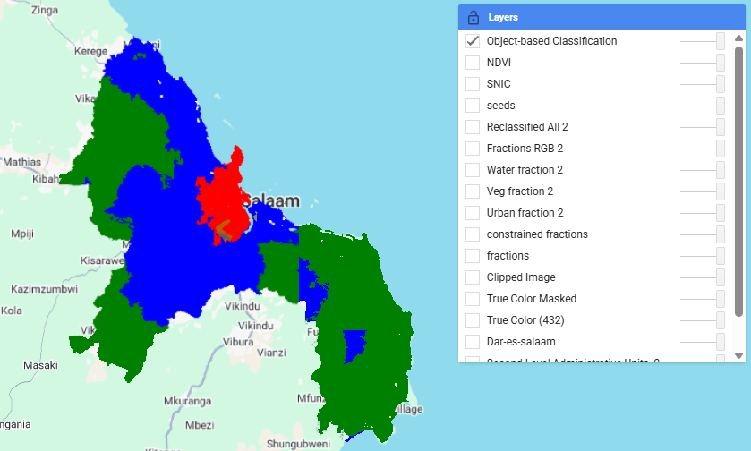

# Week 7 — Classification II

## Summary

This week’s lecture and workshop gave me a considerable understanding of how spatial complexity impacts remote sensing classification. One lecture takeaway was that, for many situations such as heterogeneous environments, the regular assumption (each pixel representing one land cover class) is a pretty unrealistic one to apply. Introducing mixed pixels is a useful framework as we understand pixel-based classification can be difficult in practice to get reliable results.

Expanding the idea further, the workshop was able to present two different proposals in order to overcome this limitation. As indicated by a sub-pixel analysis, land cover should be considered as a combination of different elements in a pixel rather than a single discrete entity. It opened my mind to “representation of proportions” rather than classification (I found this particularly illuminating when I had to study urban areas that had very fragmented land cover).

In comparison, the object-based workflow presented a new solution to the spatial complexity problem by considering the spatial arrangement of pixels. Using segmentation and object-level feature extraction, the method prioritized the contribution of spatial context as opposed to spectral information. This brought to light that classifying was more than a question of spectral separability: how could we adapt the spatial structure so as to inform interpretation?

## Sub-pixel Analysis and Mixed Pixel Problem

The sub-pixel workflow addressed a fundamental limitation in remote sensing: the presence of mixed pixels. According to Foody (2004), the assumption that each pixel corresponds to a single land cover class is often violated in real-world imagery, especially in heterogeneous urban environments. Mixed pixels may arise due to small sub-pixel features, boundary effects, or gradual transitions between land cover types. Spectral unmixing was employed on Landsat imagery to estimate the proportion of urban, vegetation, and water within each pixel. The resulting fraction maps revealed that many pixels contain a mixture of land cover types rather than a single dominant class.

The reclassified output shows a highly fragmented spatial pattern, with considerable pixel-level variability. This kind of salt-and-pepper effect reflects the inherent instability of assigning a single class to mixed pixels. Although sub-pixel analysis shows more slight differences about land cover composition, converting these fractions into classes introduces more uncertainty and noise.

## Object-based Image Analysis

To address the limitations of pixel-based approaches, the second part of the practical implemented an object-based workflow. This began with SNIC segmentation, which groups spectrally similar neighbouring pixels into spatially coherent objects.

Following segmentation, object-level features were extracted, including mean spectral bands and NDVI values. These were then used as inputs for a supervised classification model.

The object-based classification is more spatially coherent and has a smoother profile than the pixel classification result. The large homogeneous regions are much clearer, the noise seen in the sub-pixel classification is significantly reduced, and hence the graph is clearer. This enhancement is due to the fact that the influence of mixed pixels is mitigated if we combine neighbouring pixels into meaningful spatial units using object-based approaches.

## Critical Reflection

To begin with, the segmentation method brings some degree of subjectivity to the classification process. The final classification is extremely dependent on such parameters as size and compactness of an object. In this case, changing these parameters might also greatly alter the spatial structure results—indicating object-based classification is not entirely objective. Second, the approach may cause over-smoothing to occur to such an extent that the fine spatial variation is diminished. This is evident in the large homogeneous regions observed in the classification output, which may mask the more subtle or even transitional land cover features. Third, the classification reliability is highly dependent on the selection of training samples. In this case, the classification performance varied noticeably depending on the quality and representativeness of the manually selected polygons. This illustrates the need for careful training data selection in supervised classification workflows. Finally, visually improved classification results do not necessarily imply higher accuracy. Furthermore, the spatial autocorrelation in remote sensing data can lead to overly optimistic interpretations of model performance if spatial dependencies are not properly accounted for. In this respect, the spatial coherence of the object-based result may partly reflect inherent spatial structure rather than true predictive accuracy.
