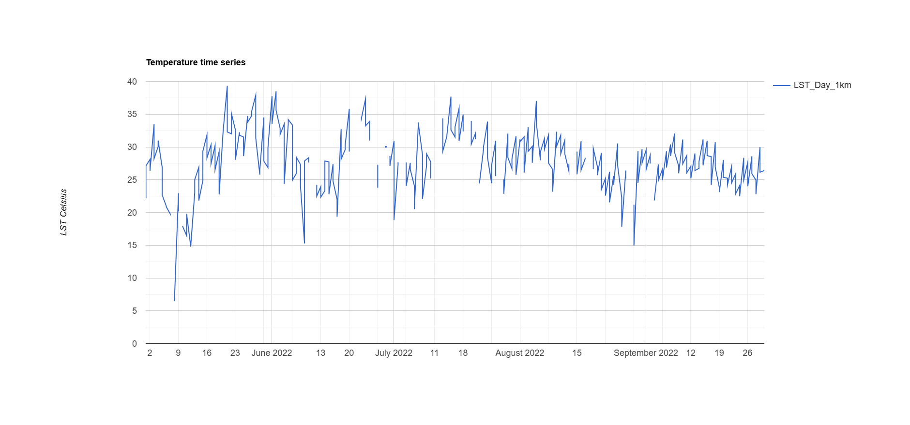

# Week 8 — Temperature

## Summary

This week I choose to focus on temperature. Trying to understanding urban heat from a remote sensing perspective.

With the application of satellite images such as Landsat and MODIS, temperature can be gauged consistently across space - at a point where real-world ground measurements would have a problem. Nevertheless, I also discovered that LST is different from air temperature, and such separation is necessary to analyze the results, especially in relation to human heat exposure. This has given me insight to the advantages and demerits of remote sensing data in urban climate investigation. The workshop also showed that heat distribution in urban areas is highly dependent on surface properties. More impervious terrain, such as roads and buildings, traps heat, while vegetated regions stay cooler. This is in line with prior studies demonstrating the urban heat island effect is primarily attributed to anthropogenic land cover modifications (MacLachlan et al. 2021). At the same time, the readings offered a more cynical view, emphasizing the fact that exposure to heat is unevenly distributed and frequently reflects more systemic socio-economic inequalities. More precisely, places with less tree cover and higher imperviousness are generally linked to elevated temperatures and less environmental protection (Nowak 2022), for instance.

## Workflow

1.Landsat imagery was used to generate a high-resolution land surface temperature (LST) map, while MODIS data were used for analysing temporal variation due to their higher revisit frequency. Pre-processing included filtering by summer months, clipping to the Beijing study area, and applying scale factors to convert raw values into Celsius. This ensured that the temperature outputs were physically meaningful and comparable across datasets. To explore temporal dynamics, a MODIS-based time series was generated (Figure 1). This shows how temperature fluctuates across the summer period, with noticeable variability rather than a stable trend. This step highlights the importance of using high-frequency data when analysing environmental processes that change over time.

2.While MODIS provides strong temporal insight, it lacks spatial detail. To address it, Landsat data were used to produce a higher-resolution temperature map. However, analysing this map directly does not allow for quantitative comparison between areas, so zonal statistics were applied.

Initially, GAUL level 2 administrative boundaries were used as spatial units, but this resulted in overly coarse aggregation, with only two units representing the entire study area. This made it difficult to interpret spatial variability. To overcome this limitation, a regular grid was introduced as an alternative spatial unit. The study area was divided into thousands of smaller cells, allowing temperature to be analysed at a much finer scale (Figure 2).

3.The temperature values of each grid cell were converted into a heat index using percentile-based classification. Each cell was assigned a value from 1 to 5, representing its relative position within the temperature distribution. This standardisation makes the results easier to interpret and compare across space, transforming raw temperature data into a more meaningful indicator of heat intensity (Figure 3).

## Results Discussion

The results reveal clear temporal and spatial patterns in land surface temperature across Beijing, highlighting both environmental processes and underlying spatial inequalities.

From a time point perspective, the MODIS time series (Figure 1) indicates that temperature varies quite significantly during the summer months, as opposed to following a uniform or regular pattern. Peak values are generally observed during mid-summer, while short-term troughs are also evident. These variations are likely due to changing weather conditions, including cloud cover and atmospheric variability, which can impact satellite-based temperature data. This highlights the significance of high-frequency datasets such as MODIS when visualizing dynamic environmental processes, as single-date imagery would therefore be insufficient to convey this variability.

In contrast, spatial patterns can be captured better by Landsat data. As depicted in the Landsat-generated temperature map (Figure 4), the heat and cold temperature in Beijing are in different local areas, with higher temperatures on the southern side, while the lower temperatures are in the north, presenting a noticeable spatial gradient. This pattern is significantly related to differences in land cover and topography. The southern areas are more urbanised and comprised predominantly of impervious surfaces, which absorb and retain heat, contrasting with the northern areas which are more mountainous and vegetated, allowing for greater cooling through evapotranspiration. This spatial dynamic is in line with what is commonly known as the urban heat island effect, where built-up environments experience higher temperatures than adjacent natural regions.

## Quick Discuss

**Could redlined areas experience higher temperatures?**

From a physical perspective, areas designated as red-line zones tend to have higher impermeable surface coverage and lower vegetation cover. The impermeable surface area increases significantly, while tree cover decreases with increasing designation level (Nowak et al., 2022). This leads to reduced evapotranspiration and increased heat retention, resulting in higher surface temperatures. Empirically, this thermal unevenness can be measured using Earth observation data, as historically, red-line zones have had average temperatures approximately 2.6°C higher than other areas, with even greater differences observed in some cities (Wilson 2020). SAR adds another layer to the knowledge. Temperature data indicates where heat is concentrated, but SAR explains why these areas are hotter. By modelling variation in surface roughness, building density, and material properties, SAR provides insight into the structural features resulting from high heat exposure. For instance, dense urban fabrics with little vegetation (a feature of historically disinvested environments) would yield specific SAR backscatter signatures as they are geometrically complex and composed of specific materials. This implies that the relationship between redlining and temperature is by no means accidental — it is mediated by urban form and land cover which can be observed using remote sensing. Decisions of past planning affected investment, infrastructure, and land use, hence the physical landscape that dictates modern temperatures.

## Refelection

At the start, I was mainly focused on getting the outputs right — making sure the temperature maps looked reasonable and the code ran without errors. But as the workflow progressed, especially when we moved into spatial aggregation, it became clear that the analytical choices behind the map matter just as much as the data itself.

For example, using the GAUL level 2 boundaries initially seemed like a straightforward step, but the result was surprisingly uninformative, with only two spatial units representing the whole study area. At first I thought something had gone wrong, but it turned out to be a limitation of the dataset rather than the method. This made me realise that spatial analysis is not just about applying tools, but also about critically evaluating whether the chosen spatial unit is appropriate. Once I switched to a grid-based approach, the results immediately became more meaningful, and the spatial patterns were much easier to interpret. So in a way, this was less of a technical fix and more of a conceptual improvement.

At the same time, working with both Landsat and MODIS also highlighted an important trade-off. Landsat gives much better spatial detail, which is great for identifying local patterns, but it lacks temporal continuity. On the other hand, MODIS captures temporal variation very well, but the spatial resolution is quite coarse. Seeing these two datasets side by side helped me better understand why combining multiple data sources is often necessary in remote sensing, rather than relying on a single ‘best’ dataset.
